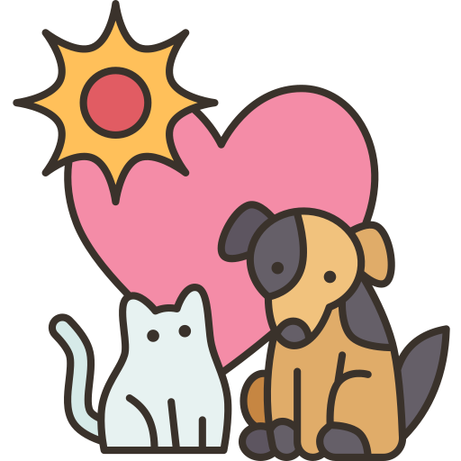

# Pet Adoption Management - Odoo Module

**Pet Adoption Management** is a comprehensive, fully-featured Odoo module designed to streamline the entire pet adoption workflow for animal shelters, rescue centers, and humanitarian organizations. From managing a detailed catalog of adoptable pets to processing online adoption applications, this module provides all the necessary tools for both administrators and the public.

<div align="center">
  
</div>

## ✨ Key Features

This module is architected to provide a seamless experience for both backend management and public-facing interactions.

### Backend Features (for Staff & Managers)

*   **🐾 Complete Pet Catalog:** Manage a detailed record for each pet, including name, species, breed, age, gender, photos, and unique tags (e.g., "Vaccinated", "Good with Kids").
*   **📋 Application Management:** A robust system for tracking adoption applications through a customizable pipeline (e.g., Submitted, In Review, Approved, Rejected) using a clean Kanban view.
*   **👤 Integrated Contacts:** Automatically links applicants to Odoo's native `res.partner` model, keeping all interaction history in one place.
*   **⚙️ Easy Configuration:** Managers can easily add, edit, or remove pet species, breeds, and descriptive tags through a dedicated configuration menu.
*   **🔐 Role-Based Security:** Two levels of access rights:
    *   **User:** Can view pets and manage applications.
    *   **Manager:** Has full CRUD access to all records, including pets, applications, and configuration.
*   **💬 Full Chatter Integration:** Track activities, log notes, and communicate with colleagues on both pet and application records.

### Frontend Features (for the Public)

*   **🌐 Public Pet Portal:** A beautifully designed, publicly accessible website page (`/pets`) showcasing all available pets in a paginated grid view.
*   **📄 Detailed Pet Profiles:** Each pet has its own dynamic detail page with a full description, photo gallery, and key information.
*   **📝 Online Application Form:** Authenticated portal users can directly apply to adopt a pet through a simple and intuitive form on the pet's detail page.
*   **✅ Instant Feedback:** Users receive an immediate "Thank You" confirmation upon submitting an application, with links to their portal to track its status.
*   **📱 Fully Responsive:** All website templates are designed to work seamlessly on desktops, tablets, and mobile devices.

## 🛠️ Technical Architecture

This module is built using the standard Odoo framework and adheres to best practices for structure and security.

*   **Framework:** Odoo 17 (Community Edition)
*   **Backend:** Python 3.12.0
*   **Database:** PostgreSQL version 14.8
*   **Frontend:** Odoo's native Website builder (XML templates with Bootstrap 4 classes)
*   **Dependencies:** `base`, `website`, `mail`, `portal`

## 📁 Module Architecture

The project is encapsulated within a single, cohesive Odoo module named `pet_adoption_management`. The structure follows Odoo's best practices:

*   **`models/`**: Contains all the Python classes that define the application's data structure and business logic.
    *   `pet_pet.py`: The central model for pet profiles.
    *   `adoption_application.py`: Manages the application and its stages.
    *   `pet_catalog.py`: Defines supporting models like species, breeds, and tags.
    *   `res_partner.py`: Inherits the base partner model to add an application count and smart button.
*   **`views/`**: Contains all XML files that define the user interface.
    *   Backend views (`pet_pet_views.xml`, etc.) define the look and feel of the management interface (Forms, Trees, Kanban).
    *   Frontend templates (`website_templates.xml`) define the public-facing website pages using QWeb.
*   **`controllers/`**: Contains the Python logic that handles HTTP requests from the website, fetches data, and renders the appropriate templates.
*   **`security/`**:
    *   `ir.model.access.csv`: Manages the fundamental CRUD (Create, Read, Update, Delete) permissions for each model.
    *   `security.xml`: Defines user groups and advanced record rules.
*   **`data/`**: XML files used to load initial or demonstration data, such as default application stages or common pet tags.

## 🗃️ Data Models

The module introduces several new models and inherits from existing ones:
*   `pet.pet`: The central model for each individual pet.
*   `adoption.application`: Tracks each application, linked to a `pet.pet` and a `res.partner`.
*   `adoption.application.stage`: Defines the customizable stages for the application Kanban view.
*   `pet.species`, `pet.breed`, `pet.tag`: Catalog models for structured data and easy filtering.
*   `res.partner`: Inherited to add a link to a contact's adoption applications.

## 🚀 Installation and Setup

1.  **Clone or Download:** Place the `pet_adoption_management` folder into your Odoo `addons` directory.
2.  **Restart Odoo Server:** Ensure the new module is picked up by the server.
    ```bash
    ./odoo-bin -c /etc/odoo/odoo.conf
    ```
3.  **Activate Developer Mode:** In your Odoo instance, go to Settings -> General Settings -> Activate the developer mode.
4.  **Update Apps List:** Go to Apps -> Update Apps List. Click "Update".
5.  **Install the Module:** Search for "Pet Adoption Management" in the Apps menu and click "Install".
6.  **Configure Permissions:** Go to Settings -> Users & Companies -> Users. Assign the "Pet Adoption / User" or "Pet Adoption / Manager" roles to the relevant users.

## 🎛️ Configuration

After installation, a manager can configure the system's core data:

1.  Navigate to the **Pet Adoption** application.
2.  Click on the **Configuration** menu item.
3.  From here, you can manage:
    *   **Species:** (e.g., Dog, Cat, Reptile)
    *   **Breeds:** (e.g., Golden Retriever, Siamese), each linked to a species.
    *   **Tags:** (e.g., Friendly, Vaccinated)

## ℹ️ How to Use

### As a Manager/User (Backend)

1.  **Add a New Pet:** Navigate to `Pet Adoption -> Pets` and click "Create". Fill in all the required details, upload a photo, and add relevant tags.
2.  **Process Applications:** Navigate to `Pet Adoption -> Applications`. You will see a Kanban view of all applications. Drag and drop applications between stages (e.g., from "Submitted" to "In Review"). Open an application to review the applicant's motivation and communicate via the chatter.

### As a Visitor/Applicant (Frontend)

1.  **Browse Pets:** Navigate to `https://<your-odoo-domain>/pets` to see all available pets.
2.  **View Details:** Click on any pet to see its detailed profile page.
3.  **Apply:** If you are logged in as a portal user, you will see the application form at the bottom of the detail page. Fill it out and click "Apply for Adoption".
4.  **Track Application:** After applying, you can go to your personal portal (usually `/my/home`) to see the status of your submitted applications.

## Workflow

The system is designed around a clear and logical workflow:

1.  **Pet Intake:** A shelter staff member creates a new `Pet` record in the backend. The status is initially `Available`.
2.  **Public Browsing:** The new pet automatically appears on the public `/pets` website page.
3.  **Application:** A potential adopter browses the site, finds a pet they love, and submits the adoption application form.
4.  **Pipeline Management:** A new `Application` record is automatically created in the backend in the "New" stage of the Kanban pipeline.
5.  **Review Process:** Shelter staff manage the application by moving it through the pipeline stages (e.g., to "In Review," "Meet & Greet"). All communication is logged in the Chatter.
6.  **Adoption Finalized:** Once an application is `Approved`, the staff updates the pet's status to `Adopted`. The pet is then automatically removed from the public website.

## Future Enhancements

This platform provides a solid foundation that can be extended with many exciting features:

*   **Advanced Search & Filtering:** Add more advanced filters to the website (age, gender, tags).
*   **Foster Management:** Create a separate model and workflow for managing foster families.
*   **Donation Integration:** Integrate with Odoo's `Website Payment` module to allow for donations, either generally or for sponsoring a specific pet.
*   **Automated Email Alerts:** Set up automated emails to notify applicants when the status of their application changes.
*   **Reporting & Dashboards:** Create dashboards to track key metrics like average adoption time, number of applications per month, and adoption success rates.

## Author

*   **Lan Anh**
*   **GitHub:** [dhlananhh](https://github.com/dhlananhh)
